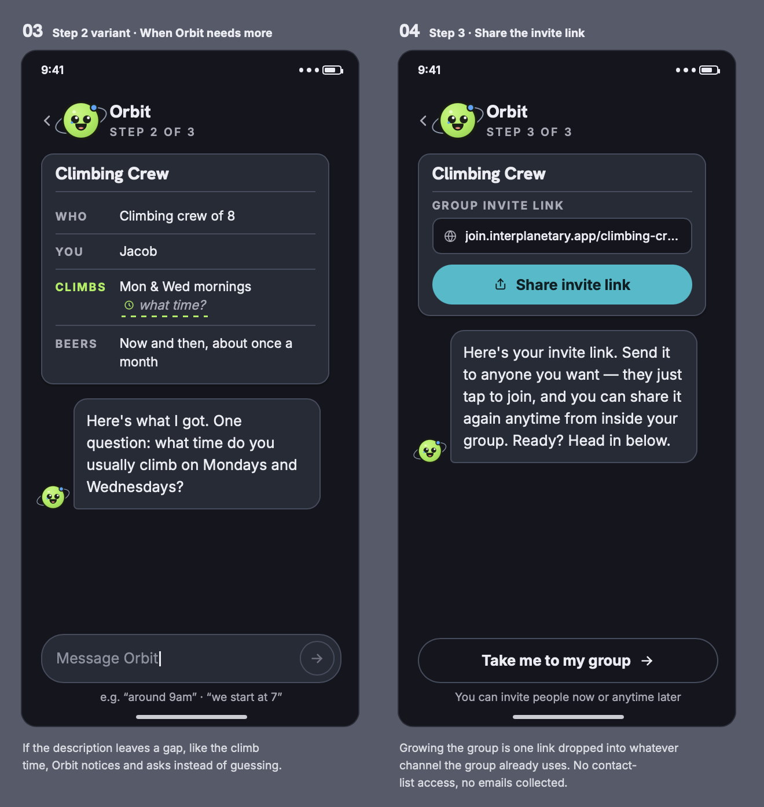
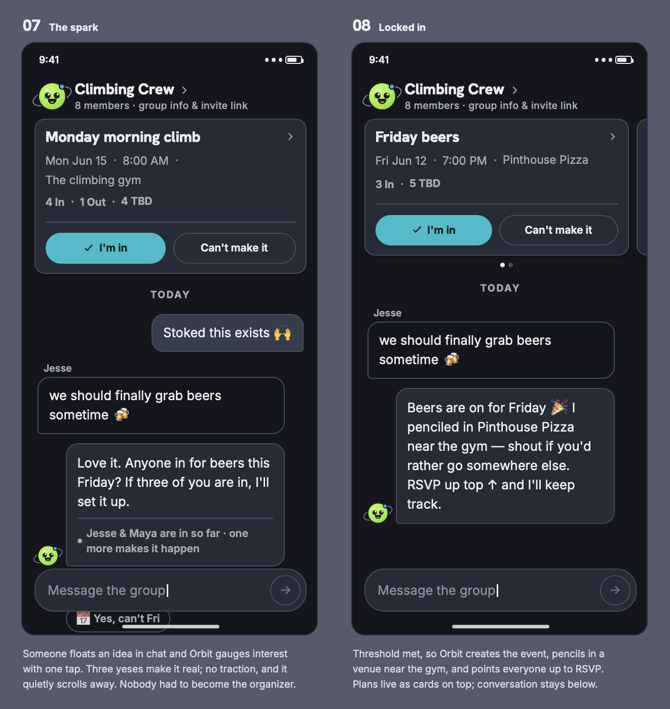

# Interplanetary Groups

**An AI coordinator for casual recurring groups, so nobody has to be the organizer.**

> **Live at [interplanetarygroups.com](https://interplanetarygroups.com).** You can start a group and walk the whole flow from the front door.

---

## The problem

Casual groups pick between two bad options. Low-effort coordination ("show up if you want") means nobody shows up. High-effort coordination (polls, forms, a group text with forty replies) feels like planning a wedding for a casual Sunday.

Interplanetary Groups gives that job to an AI coordinator named Orbit. People say what they want in plain language. Orbit checks in, sees who is interested, proposes a concrete plan, and produces a clean event page. The organizer role dissolves.

---

## How I built this with AI

The code was written with AI assistance, directed by me. Work ships in vertical slices, one at a time, each usable on its own. A slice is planned in writing before any code exists, reviewed by an independent agent that can read but not write, and closed with a record of what it decided along the way. Three written artifacts carry that, and all three live in this repo alongside the code.

- **[CLAUDE.md](CLAUDE.md)** is the project brief: product north stars, Orbit's guardrails, the load-bearing data model rules, and the UI and copy system. It states rules rather than explaining them, so it can be followed rather than interpreted.
- **[docs/build-notes.md](docs/build-notes.md)** is the decision record: the reasoning, the alternatives rejected, and the lineage behind each choice. Section 11 holds one entry per slice. Corrections land as dated annotations rather than edits, so the file shows what happened rather than only what it currently claims.
- **[docs/superpowers/specs/](docs/superpowers/specs/)** holds the planning documents: what was already settled, the non-goals and where each one belongs instead, how the work would be verified, and the debt it was expected to open. Reading one beside its build-notes entry shows intended against shipped.

**[docs/audits/](docs/audits/)** holds the whole-codebase audit run before the first deploy, and **[docs/runbooks/](docs/runbooks/)** holds the procedures that touch production.

One layer sits above all of that. **[ai-build-process](https://github.com/jacobrios/ai-build-process)** is a curated public copy of the rules I direct AI coding work under on any project: the rules themselves, the record of why each one exists, and the guardrails that mechanically block a tool call.

---

## What it does

**Setup is a conversation, not a form.** A founder describes their group the way they'd text a friend ("we're a climbing crew of 8, we go Monday and Wednesday mornings at 8"). Orbit extracts the rhythm, plays back what it understood, asks about anything genuinely missing, and creates the group with its first event already on the calendar.

**One link joins people to the group, never to an event.** No app download, no password, no account setup. A name is the only identity needed to participate. Orbit asks for an email later, once someone has actually used the group, so they can sign back in from any device.

**Anyone can start something.** When a member floats an idea in chat, Orbit proposes a specific day and time with one-tap responses and a running tally, rather than handing the group a grid of options to sort out. Three yeses and it creates the event in that same tap, inheriting the group's usual venue when the activity matches. The votes carry through as RSVPs, so nobody answers twice.

**Plans move by group decision, not by one person's word.** Asking to change an event's time in plain language opens a vote. The plan moves only when the new time clears the group's bar and beats the number of people still in on the old one.

**The plan reaches people outside the app.** An event hands a member's own calendar the plan, its meeting spot and its address, and a plan that moves after that is announced in the group feed. A digest carries what needs them and what they missed, at most once a day per group, and only when there is something to say.

**A group is invite-only.** Someone holding a group's URL without being in the group learns nothing: not the name, not who is in it, not a word of the chat. Every write refuses a non-member on the server too, so a stale tab left open by someone who has since left cannot post, RSVP, or cast the vote that creates an event.

---

## Designs

> These are design mockups, not screenshots of the running application. They show intended behavior, including some the build has not reached and some it has deliberately moved past. For what works today, open [the live site](https://interplanetarygroups.com).





---

## Keeping Orbit correct, and cheap to run

**Model output is a claim, not a fact.** Every structured extraction passes through a normalization boundary before any user-facing behavior keys off it, so nothing branches on a raw model response. Extraction once reported a field as missing that the schema never required, which would have sent Orbit to ask the founder about something the product had no reason to know. A second boundary of the same kind covers the auth service, typed so that a new failure result is a compile error at every call site rather than a member staring at a blank line.

**The model extracts structure; deterministic code composes what you see.** Orbit pulls out days, times, cadence and activity, and the screen copy is built from those fields. The model writes free prose only for its own chat messages, and even then within constrained formats. That keeps display copy stable and testable, and it produces the structured data the calendar file and reminders need anyway.

**Stored state is carried, never regenerated.** When Orbit merges a new answer into an existing group profile, untouched fields are copied verbatim rather than re-derived. Without that rule, one clarifying question was enough to make the stored activity label drift from `CLIMBING` to `CLIMB`.

**Context is bounded.** Orbit reads the last twenty messages when working out what somebody meant, not the whole feed, so what a model call costs does not grow with the group's history.

**Whole features run without a model at all.** The digest is composed entirely from stored rows and date arithmetic. Nothing in it calls a model.

**Model behavior gets its own kind of evidence.** A unit test cannot tell you whether Orbit understood a message, so two graded benches run realistic cases through the real production path and score each as a rate over repeated runs. `npm run eval:detect` grades 33 cases on how Orbit reads a message; `npm run eval:onboarding` grades 14 on rhythm extraction and the follow-up question. Both are kept out of the test suite, because they cost money and hit the network.

**Silence is a feature, and never the answer to a direct ask.** Tapping a response updates a tally; it never posts a message. Orbit speaks up on its own initiative only when it changes an outcome. That governs initiative and not replies: a member plainly asking Orbit for something gets a question back rather than nothing. Every place Orbit decides to speak or stay quiet is written down in one list, and adding a new one means adding a line to it.

**When Orbit cannot think, it says so plainly.** A model call that fails because the account ran out of credits is told apart from one that fails because the service is down, and each gets its own honest wording. The founder keeps their text and can retry. The reason shown is never a guess.

---

## Where it stands

**Working today**

- Start a group by describing it in plain language, and bring people in with one link
- Plan things together in chat: float an idea, see who is in, and the plan is created once enough people say yes
- Move a plan's time by group vote
- RSVPs, a roster, event pages, and a group page carrying the invite link and the group's own actions
- Sign back in from any device with an emailed code
- Add a plan to your own calendar, and get an email only when something is waiting on you or you missed something
- Call off one plan (for rain, say) and put it back, by anyone in the group
- "Next week" and "next Friday" land on the week the person meant
- Belong to several groups and move between them from a list
- Two people with the same name cannot join one group, so every name on screen means one person
- The chat updates live while it is open, and an open tab picks up a new release once the member is idle
- A privacy notice, terms, and deletion of a person's data by request
- An hourly self-check that alerts the owner when signed-in screens break, including when sign-in itself is down (members then see an error screen rather than being quietly signed out)
- A production build check on every pull request

**Deferred on purpose, and queued**

- Changing a plan's venue, day, or cadence. Its time can move by group vote and it can be called off, but a wrong venue, day, or cadence gets an honest decline in chat rather than a silent guess, and each is queued on its own.
- Making it impossible to end up as two people. Signing in with an email is built; someone who never adds one can still come back as a second member, which leaves the group's counts wrong in the one product whose whole claim is accurate attendance. Closing that is queued.
- Letting a founder fix a group's details after creation. Today a wrong day or time has to be caught on the playback screen before the group exists.

**Out of scope for the MVP**

Multiple venues per event, nested events, travel and logistics features, forwarded emails and screenshots as input, push notifications, photo avatars, and per-person attendance preferences. The data model accommodates all of them. The MVP deliberately does not implement any of them.

---

## How it's built

| | |
|---|---|
| Framework | Next.js 16, React 19, Tailwind 4 |
| Database | Postgres via Prisma 7, with a driver adapter |
| Auth | Supabase, auth only. The Data API is off and Prisma owns the schema, so there is exactly one source of truth. |
| AI | Claude via the Anthropic SDK, for structured extraction and Orbit's chat copy |
| Email | Resend, on two separate sending subdomains so a digest that collects spam complaints cannot damage the sending reputation login codes depend on |
| Testing | Vitest, plus two graded model benches that run outside the suite |
| Hosting | Vercel, with an hourly cron that schedules the next recurring plan, follows up on ideas and votes that have stalled, and sends the digest |

About 160 test files cover the normalization boundary, vote thresholds, RSVP and roster derivation, timezone handling, recurring-event generation, the membership wall, and the digest's send rules. Model calls are not mocked into always-succeeding shapes; the tests exercise what happens when extraction returns something wrong, because that is the case that matters.

---

## Running it locally

You'll need a Postgres database (this project uses Supabase), a Supabase project for auth, and an Anthropic API key.

```bash
cp .env.example .env     # then fill in your own values, BEFORE npm install
npm install              # its postinstall step runs prisma generate for you
npx prisma migrate deploy
npm run dev
```

**The `.env` copy comes first, and that order is load-bearing.** `npm install` runs `prisma generate` as a postinstall step, `prisma.config.ts` resolves `DIRECT_URL` the moment it loads, and a fresh clone has no `.env` because it is gitignored. Copy the file first and the install generates the client on its own, which is also what the Vercel build relies on.

**Two database URLs, and they are not interchangeable.** `DATABASE_URL` is the pooled connection the app uses at runtime through the Prisma driver adapter. `DIRECT_URL` is the unpooled one the Prisma CLI uses for migrations, read by `prisma.config.ts` rather than by the schema. Both can point at the same database, and every Prisma CLI command fails to start without `DIRECT_URL`, including `prisma generate`.

**Email fails closed outside production.** A send from a non-production environment goes only to an address named in `EMAIL_DEV_ALLOWLIST`, and an unset allowlist sends nothing. That is the intended default: a development database holds QA rows carrying real addresses, so a local run must never be one command away from mailing a real person.

`npm test` runs against a real database rather than mocks, so it needs the same `.env` in place with migrations already applied. About 40 test files need that database; the rest run without one.

```bash
npm test        # full suite
npm run lint
```

---

## License

Copyright (c) 2026 Jacob Rios. All rights reserved. The source is public so it can be read and reviewed; no license is granted to copy, modify, or redistribute it.
